<div align="center">

# 🏋️ LiftApp

### A fitness tracker with a social edge — build routines, track every set, and log your progress.

<p>
  
  
  
  
</p>

<p>
  
  
  
  
</p>

<sub><i>Run in Android Studio for the best experience.</i></sub>

</div>

---

## 🎓 About This Project

> **LiftApp was built in Fall 2021 as the final project for CSC207 — *Software Design* — at the University of Toronto.**

The assignment gave us full creative freedom: we could build **anything we wanted**. The catch was
*how* it would be graded. This wasn't marked on whether the app simply worked — it was marked on the
**quality of the software design** underneath it: Clean Architecture, SOLID principles, design
patterns, dependency management, and testability all counted.

We leaned all the way into that brief, and the project earned a **final grade of over 95%** 🎉

The result is a fully functional Android fitness tracker whose codebase is deliberately structured so
that the business rules don't know — or care — that they're running on Android or talking to Firebase.

---

## ✨ Core Features

- 📋 **Build routines** — create routines made of workouts, and workouts made of individual exercises.
- 🏃 **Track live workouts** — start a workout and log sets, reps, and weight as you go.
- 📈 **Review your history** — every completed workout is saved to a personal workout log.
- 🧩 **Flexible exercise types** — supports both rep-based and weighted-rep exercises via a clean type hierarchy.
- 👤 **Profiles & auth** — sign up, log in, and manage your profile, backed by Firebase Authentication.

---

## 🧱 Architecture

LiftApp is built on **Clean Architecture**. Dependencies always point *inward* — the UI and database
sit on the outside and depend on the business rules, never the other way around. The inner layers
talk to the outside world only through interfaces they own (the Dependency Inversion Principle), which
keeps the core logic framework-agnostic and unit-testable.

```
┌──────────────────────────────────────────────────────────────┐
│  Frameworks & Drivers   Android Activities · Firebase Gateways │
│  ┌──────────────────────────────────────────────────────────┐ │
│  │  Interface Adapters       Presenters · Repositories        │ │
│  │  ┌──────────────────────────────────────────────────────┐ │ │
│  │  │  Use Cases        Boundary interfaces (Loads…/Saves…)  │ │ │
│  │  │  ┌──────────────────────────────────────────────────┐ │ │ │
│  │  │  │  Entities   Profile · Routine · WorkoutTemplate   │ │ │ │
│  │  │  │             ExerciseTemplate · Set · PerformWorkout│ │ │ │
│  │  │  └──────────────────────────────────────────────────┘ │ │ │
│  │  └──────────────────────────────────────────────────────┘ │ │
│  └──────────────────────────────────────────────────────────┘ │
└──────────────────────────────────────────────────────────────┘
                  dependencies point inward  ──▶
```

| Layer | Responsibility | Examples in this repo |
|-------|----------------|-----------------------|
| **Entities** | Core business objects, free of any framework | `Profile`, `Routine`, `WorkoutTemplate`, `ExerciseTemplate`, `RepSet` / `WeightedSet`, `PerformWorkout` |
| **Use Cases** | Application logic + boundary interfaces | `LoadsRoutines`, `LoadsProfile`, `Loadable`, `Saveable`, `SavePerformWorkouts` |
| **Interface Adapters** | Translate between use cases and the outside world | `DashboardPresenter`, `TrackWorkoutPresenter`, `ExerciseRepository`, `ProfileReader` |
| **Frameworks & Drivers** | Android UI and Firebase persistence | `*Activity` screens, `RoutinesGateway`, `WorkoutTemplateGateway`, `LoginGateway` |

### Design patterns used

- **Factory Method** — `SetFactory` decides whether to build a `RepSet` or a `WeightedSet` from the information it's given.
- **Model–View–Presenter (MVP)** — every screen pairs an `Activity` (View) with a `Presenter`, keeping Android out of the business logic.
- **Repository / Gateway** — `ExerciseRepository` and the `*Gateway` classes hide all Firebase details behind interfaces.
- **Dependency Inversion** — outer-layer gateways implement interfaces (`LoadsRoutines`, `Saveable`, `Loadable`, …) that are *owned* by the inner layers.

---

## 🛠️ Tech Stack

| Area | Technology |
|------|------------|
| **Language** | Java 8 |
| **Platform** | Android (minSdk 26 · targetSdk 31) |
| **Backend** | Firebase — Firestore, Authentication & Realtime Database |
| **UI** | Material Components · ConstraintLayout · FirebaseUI |
| **Build** | Gradle (Android Gradle Plugin 4.2.2) |
| **Testing** | JUnit 4 · Espresso · AndroidX Test |

---

## 📸 Screenshots

#### Onboarding & Authentication

<table>
  <tr>
    <td align="center">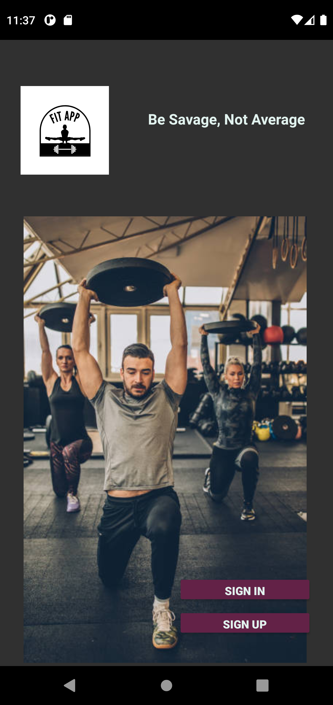<br/><sub><b>Home</b></sub></td>
    <td align="center">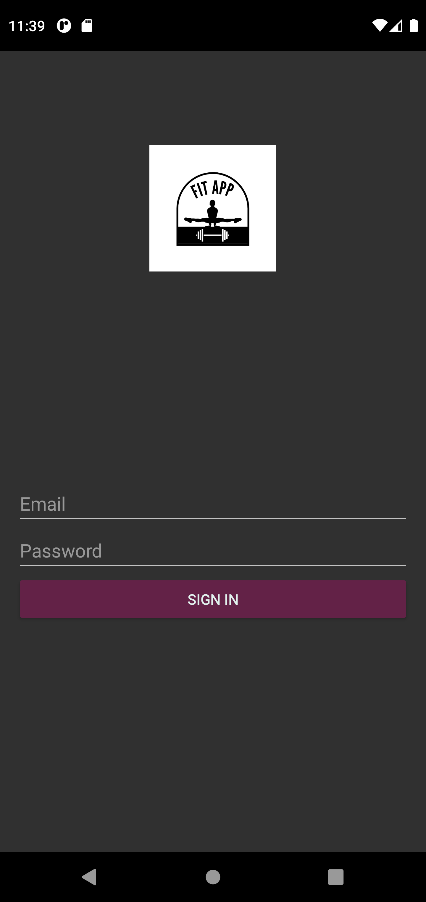<br/><sub><b>Login</b></sub></td>
    <td align="center">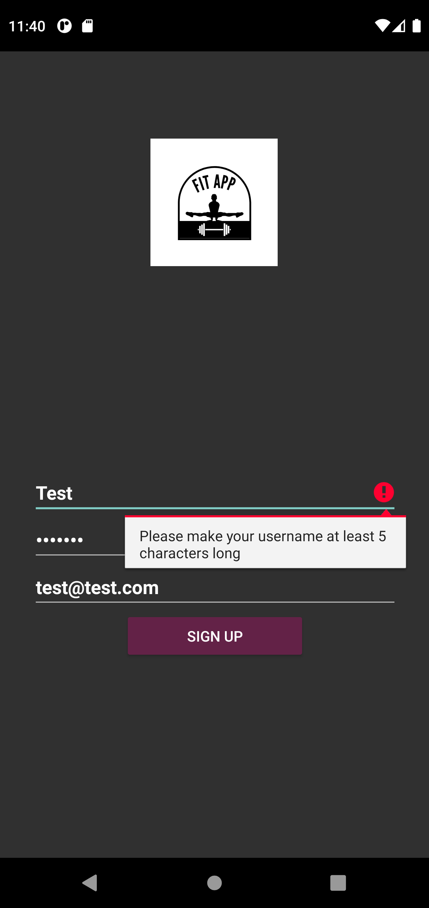<br/><sub><b>Sign Up (validation)</b></sub></td>
    <td align="center">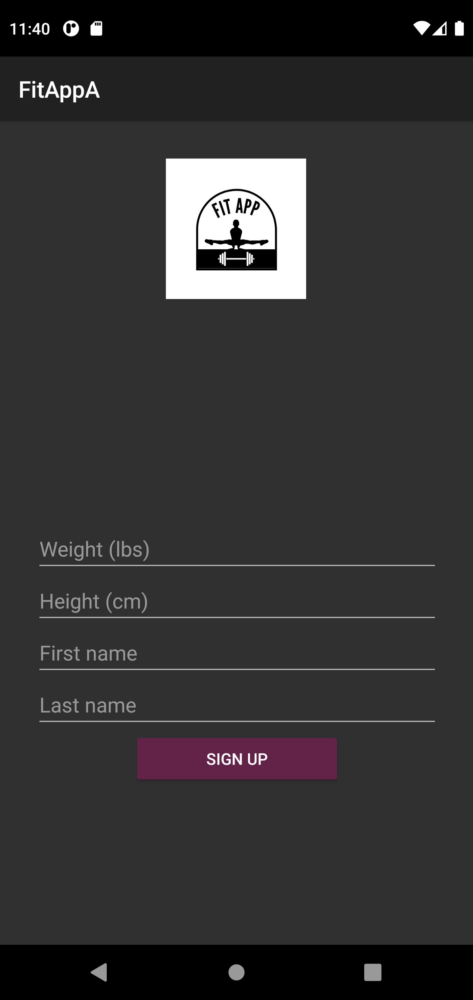<br/><sub><b>Weight Setup</b></sub></td>
  </tr>
</table>

#### Profile & Dashboard

<table>
  <tr>
    <td align="center">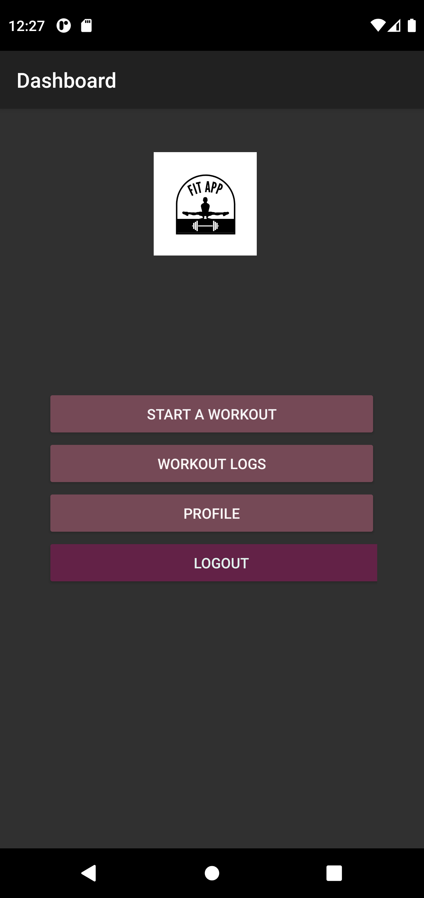<br/><sub><b>Dashboard</b></sub></td>
    <td align="center">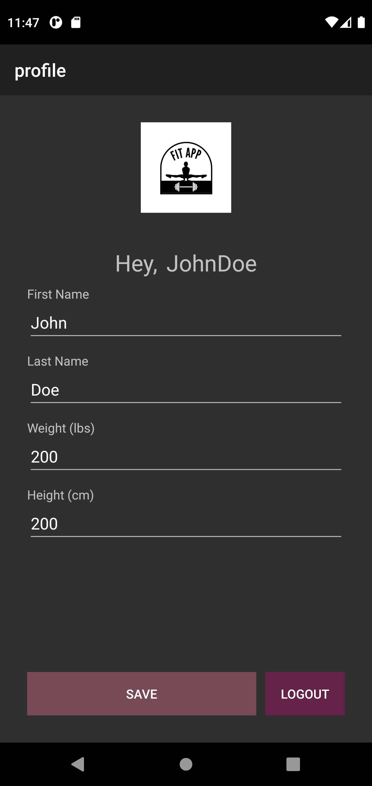<br/><sub><b>Edit Profile</b></sub></td>
    <td align="center">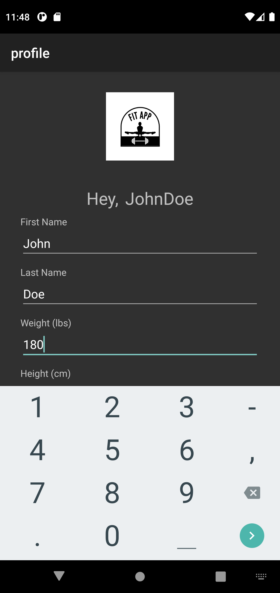<br/><sub><b>Edit Weight</b></sub></td>
  </tr>
</table>

#### Build Routines & Workouts

<table>
  <tr>
    <td align="center">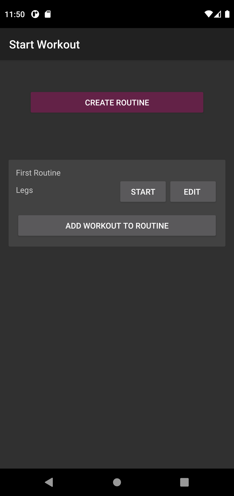<br/><sub><b>Routine List</b></sub></td>
    <td align="center">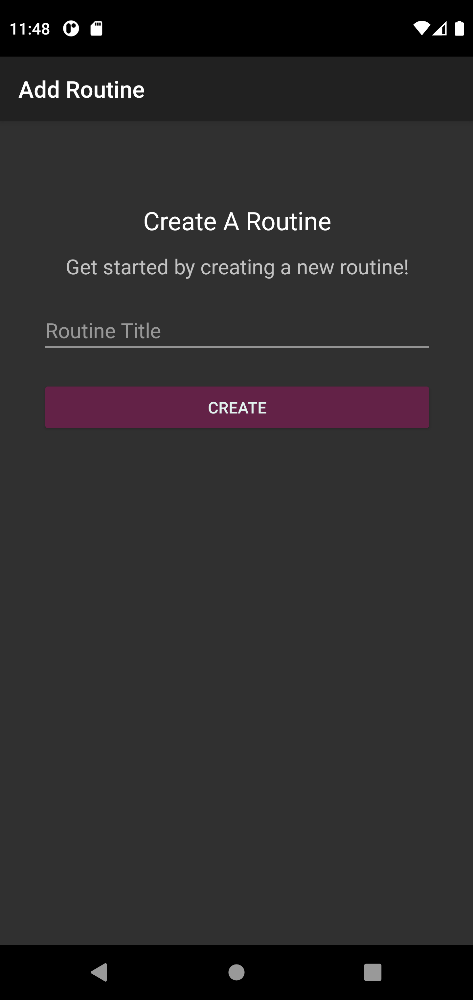<br/><sub><b>Add Routine</b></sub></td>
    <td align="center">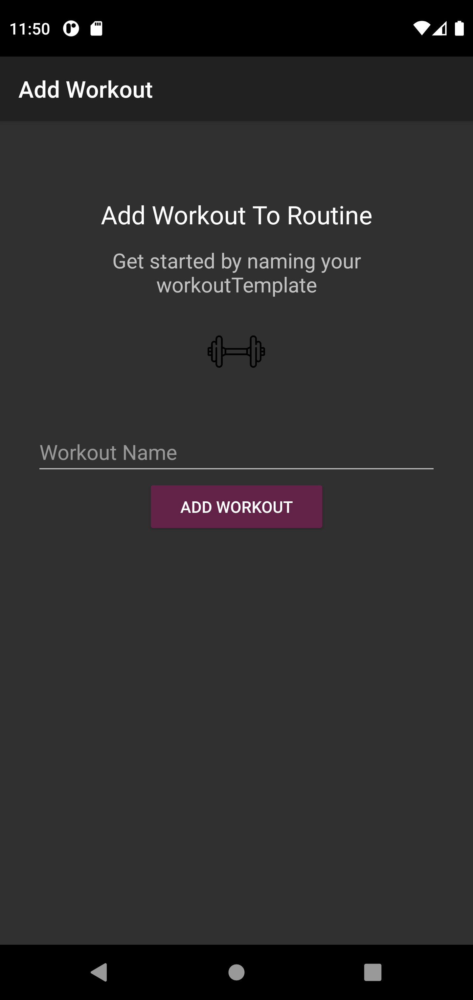<br/><sub><b>Add Workout</b></sub></td>
    <td align="center">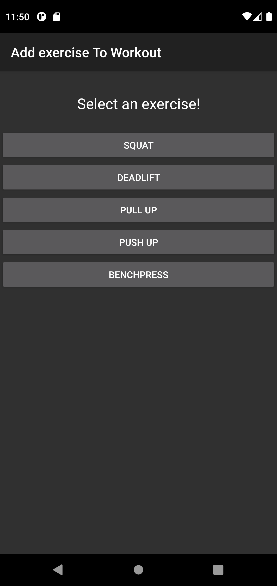<br/><sub><b>Add Exercise</b></sub></td>
  </tr>
</table>

#### Track & Log

<table>
  <tr>
    <td align="center">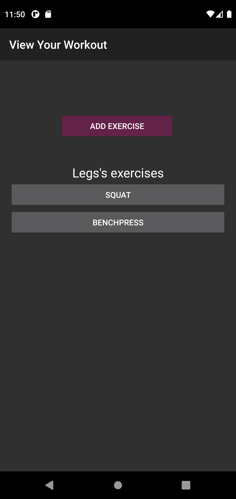<br/><sub><b>View Workout</b></sub></td>
    <td align="center">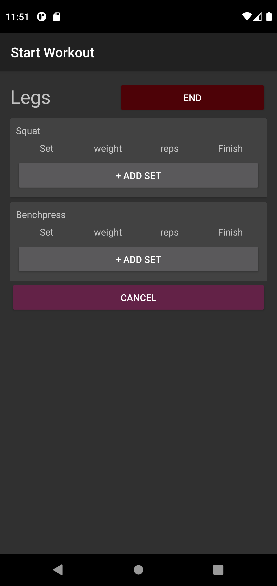<br/><sub><b>Start Workout</b></sub></td>
    <td align="center">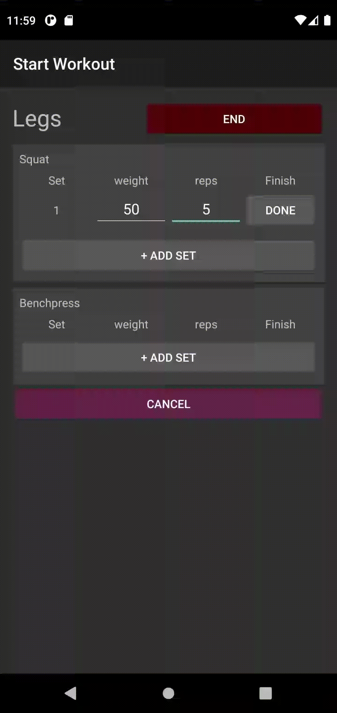<br/><sub><b>Live Tracking</b></sub></td>
    <td align="center">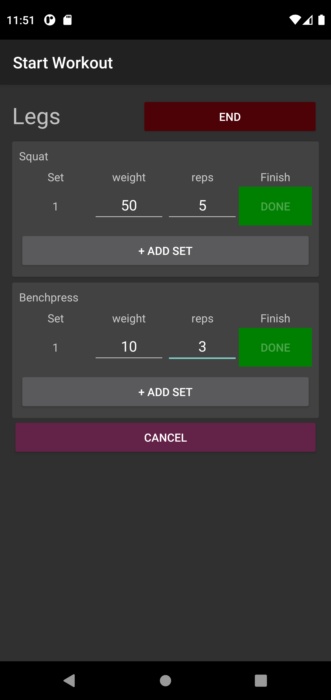<br/><sub><b>Complete</b></sub></td>
  </tr>
  <tr>
    <td align="center">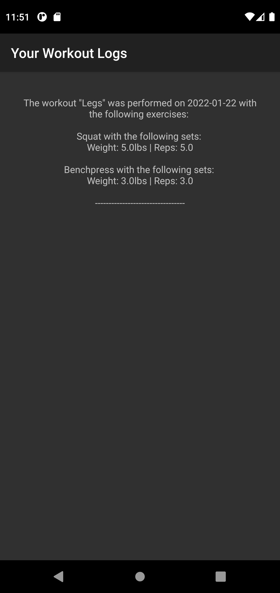<br/><sub><b>Workout Logs</b></sub></td>
  </tr>
</table>

---

## 🚀 Getting Started

```bash
# 1. Clone the repository
git clone <your-fork-url>
cd liftr

# 2. Open the project in Android Studio
#    (File ▸ Open ▸ select this folder)

# 3. Let Gradle sync, then run on an emulator or device (Android 8.0+ / API 26+)
```

> The project ships with a `google-services.json`, so it connects to Firebase out of the box.

---

## 📂 Project Structure

```
liftr/
├── app/
│   └── src/
│       ├── main/java/com/example/liftapp/
│       │   ├── authentication/   # Login, sign up, session entry points
│       │   ├── profile/          # Profile, dashboard, setup
│       │   ├── routine/          # Routines and routine gateways
│       │   ├── workout/          # Workout templates, tracking & logs
│       │   ├── exercise/         # Exercise templates + Set hierarchy / SetFactory
│       │   └── constants/        # Shared database constants
│       └── test/java/...         # JUnit unit tests for the core logic
├── phase0/                       # Specification, CRC model, progress report, walkthrough
├── phase1/                       # Design document (iteration 1)
└── phase2/                       # Final design document
```

---

## 📄 Documentation

This project was developed in phases, with design documentation at each milestone:

- 📘 [**Final Design Document**](phase2/design_document.pdf) — the most complete write-up of the architecture and decisions.
- 📗 [Design Document (Phase 1)](phase1/Design%20document%20%281%29.pdf)
- 📝 [Specification](phase0/specification.md) · [CRC Model](phase0/crc_model.pdf) · [Progress Report](phase0/progress_report.md) · [Walkthrough](phase0/walkthrough.md)

---

## 👥 Team

Built by a team of University of Toronto students for CSC207:

- Abdullah Shahid ([@nxabdullah](https://github.com/nxabdullah))
- Uthman Mohamed ([@1239uth](https://github.com/1239uth))
- Sana Sarin ([@sanasarin](https://github.com/sanasarin))
- Souren Amini-Kisomi ([@sourenrex](https://github.com/sourenrex))
- Munim Adil

<div align="center">
<sub>Final project for CSC207 — Software Design · University of Toronto · Fall 2021</sub>
</div>
